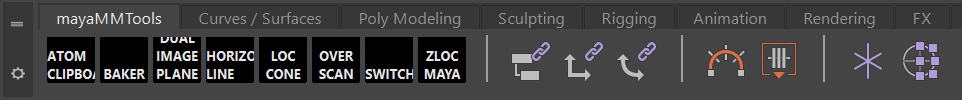
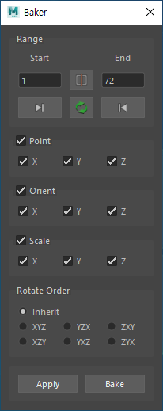

# Maya Matchmove Tools

## What does it do
- Tools for matchmove, layout and animation related tasks in Autodesk Maya.
- **Dead-Simple Installation**. Just drag and drop the `install.mel` file onto the Maya viewport.
    >  
- Creates **Run Time Commands** that you can assign hotkeys to.
    >  
- Creates **mayaMMTools** Shelf.
    >  

## Tool List
### Matchmove & Layout & Animation(Run Time Command)
1. Center3D
    >  
    - [scripts/runTimeCommand/center3d.py](scripts/runTimeCommand/center3d.py)
    - [https://github.com/kohyuk91/center3d](https://github.com/kohyuk91/center3d)
1. Cycle Through Visible Cameras Forward & Backward
    - If there is **only one visible camera** in the scene, jump between **persp camera** and the **one visible camera**.
        >  
    - If there are **more than two visible cameras** in the scene, cycle through **all visible cameras**.
      >  
    - [scripts/runTimeCommand/cycleThroughVisibleCamerasForward.py](scripts/runTimeCommand/cycleThroughVisibleCamerasForward.py)
    - [scripts/runTimeCommand/cycleThroughVisibleCamerasBackward.py](scripts/runTimeCommand/cycleThroughVisibleCamerasBackward.py)
1. Reset Pan Zoom
    - [scripts/runTimeCommand/resetPanZoom.py](scripts/runTimeCommand/resetPanZoom.py)
1. TLOC
    - "T"riangulate + "Loc"ator. TLOC helps you to triangulate points with ease.
    - [scripts/runTimeCommand/tloc.py](scripts/runTimeCommand/tloc.py)
    - [https://github.com/kohyuk91/tloc](https://github.com/kohyuk91/tloc)
1. Toggle Holdout
    - [scripts/runTimeCommand/toggleHoldout.py](scripts/runTimeCommand/toggleHoldout.py)

### Matchmove & Layout & Animation(Shelf)
1. ATOM Clipboard
    - [scripts/shelf/atomClipboard.py](scripts/shelf/atomClipboard.py)
1. Baker
    - Interface
        >  
    - [scripts/shelf/baker.py](scripts/shelf/baker.py)
1. Dual Image Plane
    - [scripts/shelf/dualImagePlane.py](scripts/shelf/dualImagePlane.py)
1. Horizon Line
    - [scripts/shelf/horizonLine.py](scripts/shelf/horizonLine.py)
1. Loc Cone
    >  
    - [scripts/shelf/locCone.py](scripts/shelf/locCone.py)    
1. Overscan
    - [scripts/shelf/overScan.py](scripts/shelf/overScan.py)
1. Switch
    - [Video Overview - YouTube](https://youtu.be/Z8jkflm7IdI)
        >  
    - Interface
        >  
    - [scripts/shelf/switch.py](scripts/shelf/switch.py)
1. ZLOC
    - Interface
        >  
    - [scripts/shelf/zloc_maya.py](scripts/shelf/zloc_maya.py)
    - [https://github.com/kohyuk91/zloc](https://github.com/kohyuk91/zloc)

### Miscellaneous(Run Time Command)
1. Smart Save
    - Similar to "Save New Comp Version" in Foundry Nuke.
    - [scripts/runTimeCommand/smartSave.py](scripts/runTimeCommand/smartSave.py)
1. Toggle Show
1. Toggle Docked Window
    >  
    - [scripts/runTimeCommand/toggleDockedGraphEditor.py](scripts/runTimeCommand/toggleDockedGraphEditor.py)
1. Toggle Pickmask
    >  
    - [scripts/runTimeCommand/togglePickmaskHandle.py](scripts/runTimeCommand/togglePickmaskHandle.py)
    - [scripts/runTimeCommand/togglePickmaskJoint.py](scripts/runTimeCommand/togglePickmaskJoint.py)
    - [scripts/runTimeCommand/togglePickmaskCurve.py](scripts/runTimeCommand/togglePickmaskCurve.py)
    - [scripts/runTimeCommand/togglePickmaskSurface.py](scripts/runTimeCommand/togglePickmaskSurface.py)
    - [scripts/runTimeCommand/togglePickmaskDeformation.py](scripts/runTimeCommand/togglePickmaskDeformation.py)
    - [scripts/runTimeCommand/togglePickmaskDynamic.py](scripts/runTimeCommand/togglePickmaskDynamic.py)
    - [scripts/runTimeCommand/togglePickmaskRendering.py](scripts/runTimeCommand/togglePickmaskRendering.py)
    - [scripts/runTimeCommand/togglePickmaskMisc.py](scripts/runTimeCommand/togglePickmaskMisc.py)
    - [scripts/runTimeCommand/togglePickmaskAll.py](scripts/runTimeCommand/togglePickmaskAll.py)
1. Toggle Pivot
    - [scripts/runTimeCommand/toggleDisplayRotatePivot.py](scripts/runTimeCommand/toggleDisplayRotatePivot.py)

## Installation
1. Download and unzip the mayaMatchmoveTools.zip file from [GitHub releases](https://github.com/kohyuk91/mayaMatchmoveTools/releases).
1. Drag and drop the `drag_and_drop_install.mel` file onto the Maya viewport.
    >  
1. Open `Hotkey Editor`
    1. Edit Hotkeys For: `Custom Scripts`
    1. Assign a Hotkey for each command
