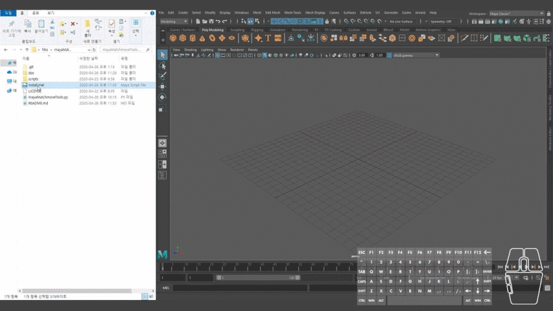
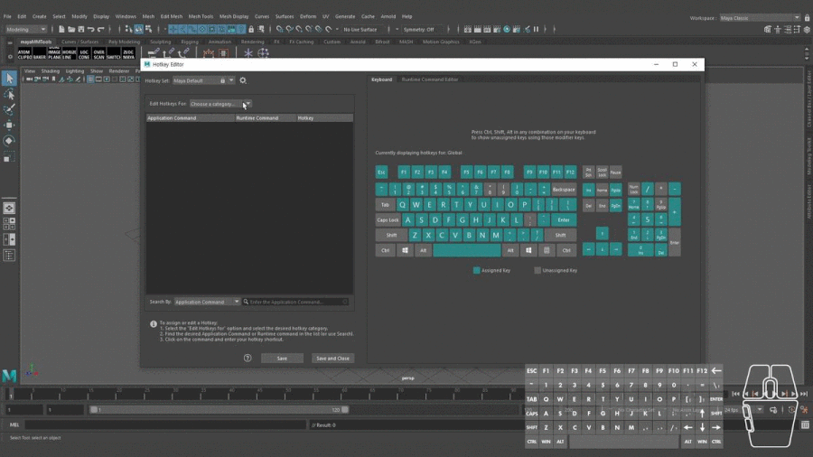
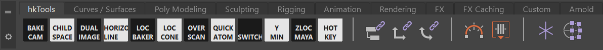
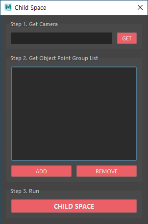
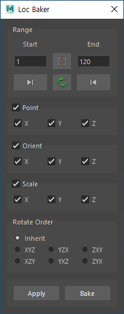
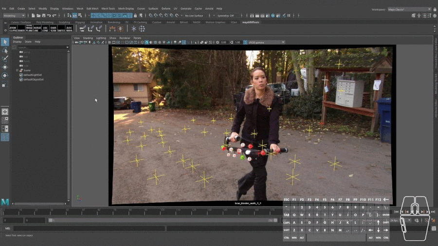
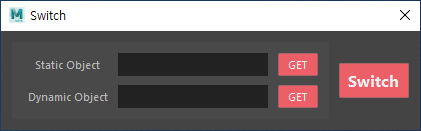
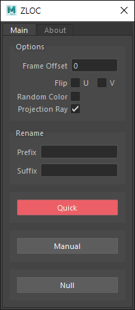

# hkTools

## What does it do
- Tools for matchmove, layout and animation related tasks in Autodesk Maya.
- **Dead-Simple Installation**. Just drag and drop the `install.mel` file onto the Maya viewport.
    >  
- Creates **Run Time Commands** that you can assign hotkeys to.
    >  
- Creates **hkTools** Shelf.
    >  

## Tool List
### Matchmove & Layout & Animation(Run Time Command)
1. Center3D
    - Center the selected transform(s) onto the camera view in Maya. Just like in 3DEqualizer.
    >  
    - [scripts/runTimeCommand/center3d.py](scripts/runTimeCommand/center3d.py)
        - Default Hotkey: Alt + Shift + C
    - [https://github.com/kohyuk91/center3d](https://github.com/kohyuk91/center3d)
1. Cycle Through Visible Cameras Forward & Backward
    - If there is **only one visible camera** in the scene, jump between **persp camera** and the **one visible camera**.
        >  
    - If there are **more than two visible cameras** in the scene, cycle through **all visible cameras**.
      >  
    - [scripts/runTimeCommand/cycleThroughVisibleCamerasForward.py](scripts/runTimeCommand/cycleThroughVisibleCamerasForward.py)
        - Default Hotkey: Alt + Shift + E
    - [scripts/runTimeCommand/cycleThroughVisibleCamerasBackward.py](scripts/runTimeCommand/cycleThroughVisibleCamerasBackward.py)
        - Default Hotkey: Alt + Shift + Q
1. Reset Pan Zoom
    - [scripts/runTimeCommand/resetPanZoom.py](scripts/runTimeCommand/resetPanZoom.py)
        - Default Hotkey: Alt + Shift + R
1. TLOC
    - "T"riangulate + "Loc"ator. TLOC helps you to triangulate points with ease.
    - [scripts/runTimeCommand/tloc.py](scripts/runTimeCommand/tloc.py)
        - Default Hotkey: Alt + Shift + X
    - [https://github.com/kohyuk91/tloc](https://github.com/kohyuk91/tloc)
1. Toggle Holdout
    - Toggles Hold-Out in shape node's Render Stats.
        - If nothing is selected toggle Hold-Out for all objects in scene.
        - If objects are selected toggle Hold-Out for only selected objects.
    - [scripts/runTimeCommand/toggleHoldout.py](scripts/runTimeCommand/toggleHoldout.py)
        - Default Hotkey: `

### Matchmove & Layout & Animation(Shelf)
1. Switch Hotkey Set
    - Cycle through hotkey sets. No need to open the Hotkey Editor.
    - [scripts/shelf/_HotKey.py](scripts/shelf/_HotKey.py)
1. Bake Cam
    - Bakes the camera to world space by reparenting to world.
    - [scripts/shelf/bakeCam.py](scripts/shelf/bakeCam.py)
1. Child Space
    - Display object point group's rotation and position curves in child space(instead of global space).
    - In child space we are able to scale the object point group without any shifting in screen space for the entire time range.(Just like scaling object point groups in 3DEqualizer.)
    - Interface
      >  
    - [scripts/shelf/childSpace.py](scripts/shelf/childSpace.py)
1. Dual Image
    - [scripts/shelf/dualImage.py](scripts/shelf/dualImage.py)
1. Horizon Line
    - Creates an artificial horizon line for the active cam.
    - [scripts/shelf/horizonLine.py](scripts/shelf/horizonLine.py)
1. Loc Baker
    - Bakes selected(or multiple) transform node's translation, rotation and scale to a locator.
    - Interface
      >  
    - [scripts/shelf/locBaker.py](scripts/shelf/locBaker.py)
1. Loc Cone
    - Creates a cone for each selected locator(transform node).
    >  
    - [scripts/shelf/locCone.py](scripts/shelf/locCone.py)    
1. Overscan
    - [scripts/shelf/overScan.py](scripts/shelf/overScan.py)
1. Quick ATOM
    - Quick ATOM script uses Maya's ATOM (Animation Transfer Object Model). Just tweaked it a little bit to use it in a copy & paste fashion.
    - [Video Overview](https://youtu.be/WLe3mYEnJUo)
        >  
        > Kila rig by antCGI([https://www.antcgi.com/](https://www.antcgi.com/))
    - [scripts/shelf/quickAtom.py](scripts/shelf/quickAtom.py)
1. Switch
    - Switches motion between a Static Object and a Dynamic Object.
    - [Video Overview](https://youtu.be/Z8jkflm7IdI)
        >  
    - Interface
        >  
    - [scripts/shelf/switch.py](scripts/shelf/switch.py)
1. YMin
    - Moves selected(or multiple) object's pivot to XZ center and Y minimum of bounding box.
    - [scripts/shelf/yMin.py](scripts/shelf/yMin.py)
1. ZLOC
    - ZLOC is a 2.5D tracker system built for Science-D-Visions 3DEqualizer and Autodesk Maya. (Based on SynthPipe by Martin Kulig)
    - Interface
        >  
    - [scripts/shelf/zloc_maya.py](scripts/shelf/zloc_maya.py)
    - [https://github.com/kohyuk91/zloc](https://github.com/kohyuk91/zloc)

### Miscellaneous(Run Time Command)
1. Smart Save
    - Save next avaible version following `_v#` naming convention.
    - Similar to "Save New Comp Version" in Foundry Nuke.
    - [scripts/runTimeCommand/smartSave.py](scripts/runTimeCommand/smartSave.py)
        - Default Default Hotkey: Alt + Shift + S
1. Toggle Show
1. Toggle Docked Window
    - [scripts/runTimeCommand/toggleDockedGraphEditor.py](scripts/runTimeCommand/toggleDockedGraphEditor.py)
        >  
        - Default Default Hotkey: Alt + 2
    - [scripts/runTimeCommand/toggleDockedOutliner.mel](scripts/runTimeCommand/toggleDockedOutliner.mel)
        - Default Default Hotkey: Alt + 1        
1. Toggle Pickmask
    >  
    - [scripts/runTimeCommand/togglePickmaskHandle.py](scripts/runTimeCommand/togglePickmaskHandle.py)
    - [scripts/runTimeCommand/togglePickmaskJoint.py](scripts/runTimeCommand/togglePickmaskJoint.py)
    - [scripts/runTimeCommand/togglePickmaskCurve.py](scripts/runTimeCommand/togglePickmaskCurve.py)
    - [scripts/runTimeCommand/togglePickmaskSurface.py](scripts/runTimeCommand/togglePickmaskSurface.py)
    - [scripts/runTimeCommand/togglePickmaskDeformation.py](scripts/runTimeCommand/togglePickmaskDeformation.py)
    - [scripts/runTimeCommand/togglePickmaskDynamic.py](scripts/runTimeCommand/togglePickmaskDynamic.py)
    - [scripts/runTimeCommand/togglePickmaskRendering.py](scripts/runTimeCommand/togglePickmaskRendering.py)
    - [scripts/runTimeCommand/togglePickmaskMisc.py](scripts/runTimeCommand/togglePickmaskMisc.py)
    - [scripts/runTimeCommand/togglePickmaskAll.py](scripts/runTimeCommand/togglePickmaskAll.py)
1. Toggle Pivot
    - [scripts/runTimeCommand/toggleDisplayRotatePivot.py](scripts/runTimeCommand/toggleDisplayRotatePivot.py)
        - Default Default Hotkey: *   

## Installation
1. Download and unzip the mayaMatchmoveTools.zip file from [GitHub releases](https://github.com/kohyuk91/hkTools/releases).
1. Drag and drop the `drag_and_drop_install.mel` file onto the Maya viewport.
    >  
1. Open `Hotkey Editor`
    >  
    1. Edit Hotkeys For: `Custom Scripts`
    1. Assign a Hotkey for each command
